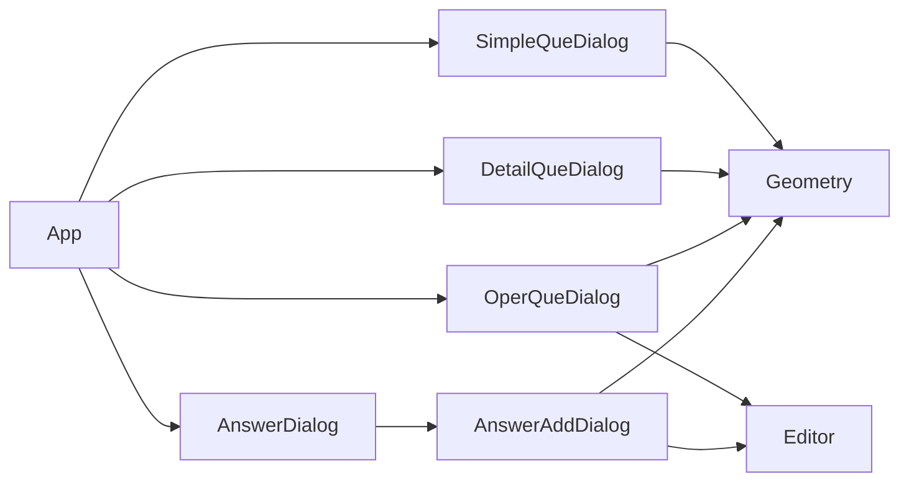

## web几何宝典前端代码
### 修改:
#### 1. 封装网络请求
- 将web应用所有的网络请求封装到src/network/index.js模块中
  - src/network/request.js文件封装了用axios创建的实例和基本的请求函数request
  - 在index.js文件中引用了request函数，进一步封装网络请求
#### 2. 修改main.js
- 直接使用render函数渲染App组件，提高应用加载速度
- 删除原本直接引用到全局的axios默认实例
#### 3. App.vue代码整理
- 将原有代码中所有的el-dialog组件全部抽离到src/components/dialog文件夹下
- 组件树结构如下：

#### 4. 将一些公共的方法提取到/src/js/common/PublicMethods.js文件下
